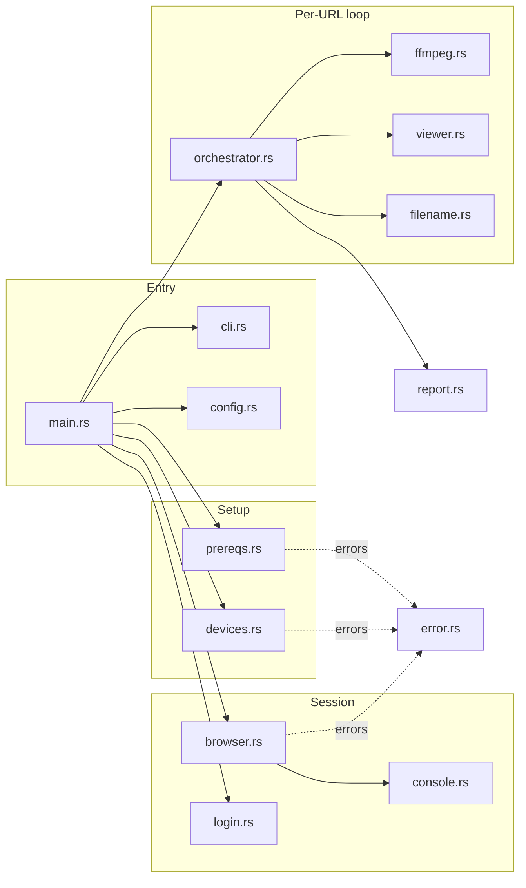

# 🏗️ Architecture

Back to [[Recorder - Home]]. For *what runs when*, see [[Data Flow]]. For *why*, see [[Decisions (ADR)]].

## Mental model

Three independent things cooperate, coordinated by one orchestrator:

1. **A browser** showing a real page ([[Module Reference#browser.rs]]).
2. **A screen recorder** filming the display ([[Module Reference#ffmpeg.rs]]).
3. **A viewer script** scrolling the page like a human ([[Module Reference#viewer.rs]]).

The [[Module Reference#orchestrator.rs|orchestrator]] runs them in the right order for each URL and writes a [[Module Reference#report.rs|report]].

> [!important] Why "film the screen" instead of an API recording?
> The spec required FFmpeg AVFoundation capture, *not* the browser's built-in recording. So the browser and recorder are decoupled: the browser just needs to be **visible and frontmost**, and FFmpeg captures whatever is on the display. This is why [[Gotchas and Edge Cases#Window must be maximized AND frontmost|maximize + foreground]] matter so much.

## Component diagram

## Layered responsibilities

| Layer | Modules | Responsibility |
|---|---|---|
| **Entry / config** | `main`, `cli`, `config` | Parse args, build [[Module Reference#config.rs\|RecorderConfig]], orchestrate top-level steps |
| **Setup (run once)** | `prereqs`, `devices` | Ensure ffmpeg + Chromium exist; find the screen capture device |
| **Session (run once)** | `browser`, `login`, `console` | Launch one Chromium, manual login, attach console capture |
| **Per-URL (the loop)** | `orchestrator`, `ffmpeg`, `viewer`, `filename` | Record each URL: start capture, navigate, scroll, stop, name file |
| **Cross-cutting** | `report`, `error` | Write `report.json`; typed setup errors |

## Key architectural rules (don't break these)

> [!warning] One browser, one page, for the whole run
> A **single** `Browser` + **single** `Page` is reused for login and every URL. That's what makes the login **session persist** across the queue. Creating a new context/page per URL would log you out. See [[Decisions (ADR)#ADR-5 Single reused page + manual login]].

> [!warning] Every FFmpeg start has a matching graceful stop
> Otherwise ffmpeg processes pile up across 100 URLs (and files stay unplayable). The recorder owns the child process lifecycle — see [[Data Flow#Stopping FFmpeg gracefully]].

> [!warning] A per-URL failure must never abort the run
> The orchestrator wraps each URL so one bad page (timeout, nav error) is recorded as `failed` in the report and the loop continues. See [[Module Reference#orchestrator.rs]].

## Concurrency shape

- The whole app is `tokio` async, single logical flow (the queue is **sequential** by design).
- Background tasks that *do* run concurrently:
  - the **CDP handler** stream (keeps the browser alive),
  - **FFmpeg stdout/stderr readers** (readiness + logs),
  - **console event listeners** (per-page logs).
- These are spawned with `tokio::spawn` and joined/aborted on cleanup.

#recorder
