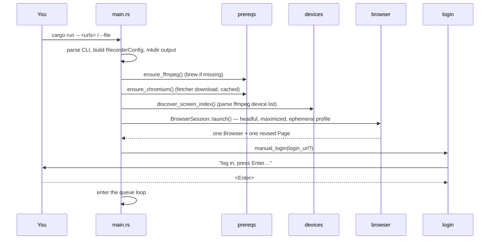
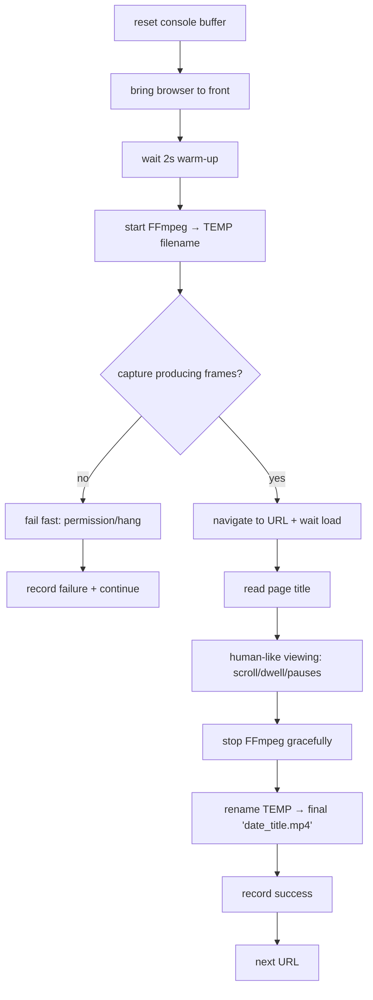
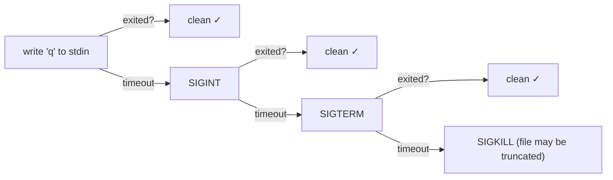

# 🔄 Data Flow

Back to [[Recorder - Home]]. Pairs with [[Architecture]] (the *what*) — this is the *when*.

## Phase 1 — Startup (runs once)



What each step produces:

| Step | Output | Notes |
|---|---|---|
| `ensure_ffmpeg` | ffmpeg on PATH | else `brew install ffmpeg`; else hard error |
| `ensure_chromium` | path to Chromium binary | downloaded once to `~/Library/Caches/recorder/chromium` |
| `discover_screen_index` | a device index (e.g. `1`) | from `ffmpeg -f avfoundation -list_devices true -i ""` |
| `BrowserSession::launch` | `Browser` + `Page` | window maximized via CDP bounds; [[Glossary#Ephemeral profile]] |
| `manual_login` | a logged-in session | session lives in the reused page for the rest of the run |

## Phase 2 — The per-URL loop (the heart of it)

For **each** URL in the queue, the [[Module Reference#orchestrator.rs|orchestrator]] runs `record_one`. The ordering is deliberate (see callouts):



> [!important] Why a **temp filename**, then rename?
> The final name is `YYYY-MM-DD_HH-MM-SS_<page-title>.mp4`, but the **title isn't known until the page loads** — which happens *after* recording starts. So we record to a temp name and rename on stop. See [[Decisions (ADR)#ADR-7 Temp filename then rename]] and [[Module Reference#filename.rs]].

> [!important] Why wait for **capture readiness** before navigating?
> AVFoundation takes a moment to actually start producing frames. If we navigated immediately, the page load would happen *before* the camera was rolling and we'd miss it. We wait for FFmpeg's `-progress` to report `frame>=1`. If it never does, it's almost always the [[Gotchas and Edge Cases#Black frames — Screen Recording permission|permission gate]] → we fail that URL fast with a clear message instead of writing a black file.

### The two warm-up waits (don't confuse them)

| Wait | Where | Why |
|---|---|---|
| **2s pre-record** | after `bring_to_front`, before starting ffmpeg | let the window settle / be frontmost |
| **capture readiness** | after starting ffmpeg, before navigating | let AVFoundation actually emit frames |

## Stopping FFmpeg gracefully

The MP4 is only playable if FFmpeg writes its [[Glossary#moov atom]] on exit. So [[Module Reference#ffmpeg.rs|stop()]] escalates:



`forced_stop: true` in the report means we had to SIGKILL — that recording may be truncated. See [[Decisions (ADR)#ADR-8 Graceful FFmpeg shutdown]].

## Phase 3 — Cleanup & report

- After the loop: `BrowserSession::close()` closes Chromium, aborts the CDP handler task, and **deletes the ephemeral profile**.
- `report.json` is written **after every URL** (crash-safe) and once at the end. Structure in [[Module Reference#report.rs]].

## What lands on disk

```
recordings/
├── 2026-06-02_23-29-14_rust-programming-language-wikipedia.mp4   # one per success
├── errors/
│   ├── 2026-06-02_23-24-01_example-com.png                       # failure screenshot
│   └── 2026-06-02_23-24-01_example-com.log                       # console + ffmpeg log
└── report.json                                                   # summary + per-URL records
```

#recorder
