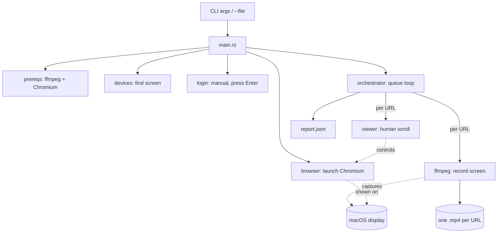

# 🎬 Recorder — Home

> [!abstract] One-liner
> A **macOS-only Rust CLI** that logs into a website **once**, then walks a **queue of URLs** in that same logged-in session, recording each page to its own **MP4** with **human-like scrolling**. It uses **FFmpeg** for screen capture and **Chromium** (via `chromiumoxide`) for browser control. Output is one video per URL plus a `report.json`.

This is the **Map of Content (MOC)** — your starting point. Every other note links back here.

## 🧭 Read in this order (junior onboarding path)

1. [[Setup and Onboarding]] — get it running on your machine in ~15 min.
2. [[Glossary]] — the 12 terms you must know (AVFoundation, CDP, HEVC…).
3. [[Architecture]] — the modules and how they fit.
4. [[Data Flow]] — what actually happens, step by step, when you run it.
5. [[Tech Stack]] — every crate/tool and *why* it's here.
6. [[Decisions (ADR)]] — *why* it's built this way (the non-obvious calls).
7. [[Module Reference]] — file-by-file, function-by-function.
8. [[Gotchas and Edge Cases]] — the traps that cost real debugging time.

## 🗺️ The whole system on one screen

> [!tip] The core idea in one sentence
> We don't capture the browser through an API — we put a **real Chromium window** on screen, then **film the screen** with FFmpeg while a script scrolls the page like a person.

## 📌 What it is / is not

| It **is** | It **is not** |
|---|---|
| macOS only (AVFoundation) | Cross-platform |
| Full-screen capture → 480p | Cropped to the browser window |
| One reused tab, session persists | A new context per URL |
| Manual login (you type credentials) | Automated credential filling |
| Sequential queue (one at a time) | Parallel recording |

## 🔗 Quick links

- Code entry point: `src/main.rs` → see [[Module Reference]]
- Why Rust + chromiumoxide, not Playwright: [[Decisions (ADR)#ADR-2 chromiumoxide over Playwright]]
- "My video is black": [[Gotchas and Edge Cases#Black frames — Screen Recording permission]]
- Build plan that started it all: see the repo's plan file / PR.

#recorder
